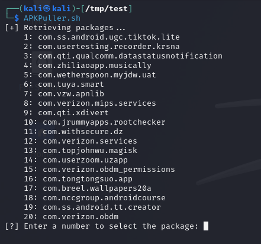
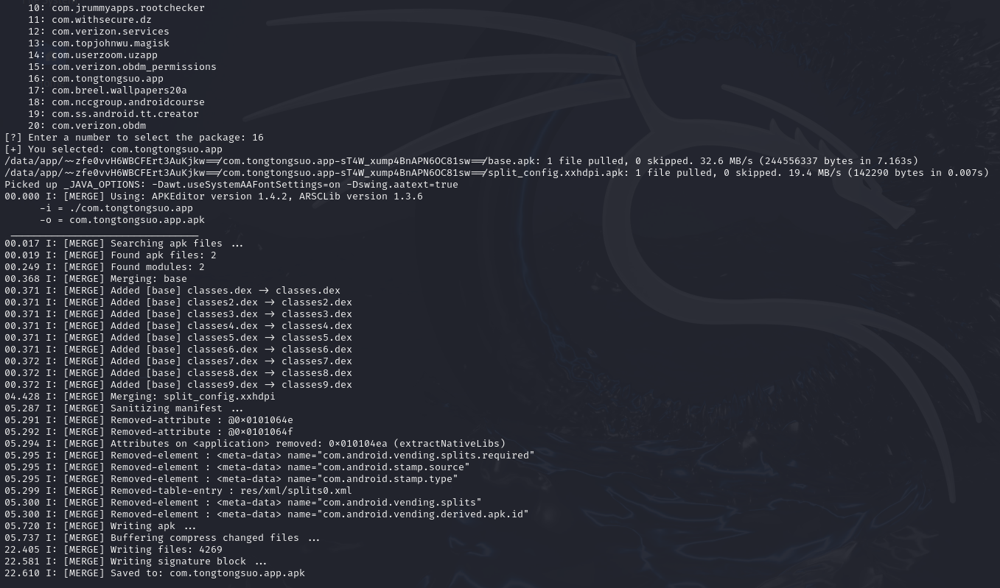

# APKPuller

## Description

Script to pull all splits from an android package and merges them

## Requirements
`APKEditor.jar` is needed to merge all the splits (included in this repo).

Also, you will need `adb` in your path.


## Usage
```bash
APKPuller.sh
```

It will show all packages as a list 



Then you will have to select a number according to the package and the script will download all the splits and the base to merge them



